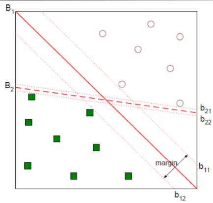
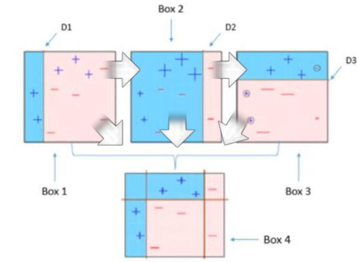
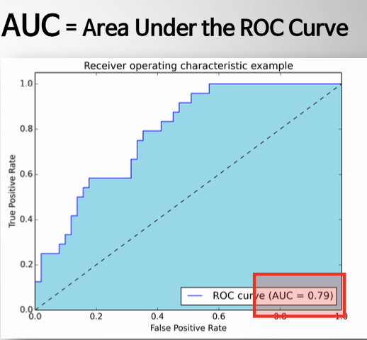

# 머신러닝 핵심 이론 & Scikit-learn 실습

### 1. 인공지능이란

### 2. 머신러닝 핵심 개념 이해

### 3. 머신러닝 알고리즘 이론

### 4. 머신러닝 알고리즘 실습 with Scikit-learn


## 1. 인공지능이란

- 자신을 둘러싼 **환경을 지각/인식**하고 **적절한 행동**을 취하며 **목표를 성취**할 가능성을 최대화 하는 기계(가 가진 **지능**)

- 지능 규정 범위에 따른 구분

  - 약 인공지능 (weak AI)

    > - 좁은 의미의 인공지능
    > - 한가지 일을 잘 수행함

  - 강 인공지능 (string AI)

    > - 일반적인 의미의 인공지능
    > - 사람만큼 똑똑한 AI
    > - 사람처럼 주변환경을 이해함

  - Super AI

    > - 매우 매우 슈퍼 똑똑

- 데이터를 활용하여 **모델**을 만들고 모델을 적용한 **기능**을 만듦

  > **모델**
  >
  > - 데이터에게 맞는 설명 방법을 찾는 과정 
  > -  데이터를 가장 잘 표현하는 모델을 찾는 과정
  > - Model fitting
  >   1. 초기 모델(가설 모델)에 데이터를 넣는다.
  >   2. 결과를 평가한다.
  >   3. 결과를 개선하기 위해 모델을 수정한다.
  >
  > **학습**
  >
  > - 실제 정답과 예측 결과 사이의 오차 (Loss, Cost, Error)를 줄여나가는 최적화 과정


## 2. 머신러닝의 핵심 개념 이해

- 머신러닝이란?

  1. 어떠한 과제를 해결하는 과정에서
  2. 특정한 평가 기준을 바탕으로
  3. 학습의 경헙을 쌓아나가는 프로그램

- 머신러닝의 분류

  

  1. 지도 학습 (Supervised Learning)

     - input data에 대한 **정답을 예측**하기 위해 학습 (Function approximator)

     - 데이터에 정답 (Label, Target)이 존재함

     - Output의 형태에 따라 회귀 분석과 분류 분석으로 나뉨

       > 회귀 Regression : output이 실수 영역 전체에서 나타남
       >
       > 분류 Classification : output이 class에 해당하는 분연속 값으로 나타남

     - 대표 알고리즘

       > Linear/Logistic regression, Decision tree, Bayesian classification, Neural network, ...

  2. 비지도 학습 (Unsupervised Learning)

     - Input data 속에 숨어있는 규칙성을 찾기 위해 학습 (shorter description)

     - 데이터에 정답이 존재하지 않음

       > 군집 분석 Clustering Algorithm
       >
       > 차원 축소 Dimensionality reduction (or Compression)

     - 대표 알고리즘

       > K-Means clustering, Nearest Neighbor Clustering, t-SNE, EM Clustering, Principal component analysis (PCA), Linear Discriminant Analysis(LDA, ...

  3. 강화 학습 (Reinforcement Learning)

     - Trial & Error를 통한 학습 (Sequential decision making)

     - 주위 환경과 자신의 행동(Decision) 사이의 반복적 상호작용을 바탕으로 최종적으로 얻게 될 기대 보상을 최대화하기 위한 행동 선택 정책을 학습

     - 연속적인 단계마다 **상태(State) 를 인식**하고, 각 상태에 대해 결정한 **행동(Action)**들의 집합에 대해, 환경으로부터 받는 **보상(Reward)**을 학습하여, 전체 행동에 대한 보상을 최대화하는 **행동 선택 정책(Policy)**을 찾는 알고리즘

     - 대표 알고리즘

       > Monte Carlo methods, Markow Decision Processes, Q-learning, Deep Q-learning, Dynamic Programming, ...

- 과적합 (Overfitting)과 일반화 (Generalization)

  > Capacity의 극대화 -> Overfitting 발생 -> Generalization error 증가 -> 새로운 데이터에 잘 대응하지 못함

  - 새로운 데이터들에 대해서도 좋은 결과를 내게 하려면?

    - **교차 검증 (Cross validation)**

    

    - **K-Fold cross validation**
    - **Drop-out & Batch Normalization**
    - Training data를 많이 확보, 모델의 Feature 줄이기


## 3. 머신러닝 알고리즘 이론


##### Linear Regression (선형 회귀)

- 종속 변수 y와 한개 이상의 독립변수 x 사이의 선형 상관 관계를 모델링하는 회귀분석 기법

- 정답이 있는 데이터와 추세를 잘 설명하는 선형 함수를 찾아 x에 대한 y를 예측

- 단순 회귀 분석 : 1개의 독립변수가 1개의 종속변수에 영향을 미칠 때

  

- 다중 회귀 분석 : 2개 이상의 독립변수가 1개의 종속변수에 영향을 미칠 때


- 가장 적합한 θ들의 set을 찾는 것이 목표


##### Cost Function 과 Gradient Descent Alogorithm

- **Cost Function** (비용함수) 

  - 예측 값과 실제 값의 차이를 기반으로 모델의 성능(정확도)을 판단하기 위한 함수

  - Linear regression의 경우 **Mean Squared Error** function을 활용

    > MSE가 최소가 되도록하는 θ를 찾아야 한다. (Gradient Descent Alogorithm)

- **Gradient Descent Algorithm** (경사하강법)

  

  - Cost function의 값을 최소로 만드는 θ를 찾아나가는 방법

  - Cost function의 Gradient에 상수를 곱한 값을 빼서 θ를 조정

  - Cost function에서 경사가 아래로 되어있는 방향으로 내려가서 Cost가 최소가 되는 지점을 찾는다. 어느 방향으로 θ를 움직이면 Cost 값이 작아지는지 현재 θ 위치에서 Cost함수를 미분하여 판단

  - Learning Rate (학습률) : 얼마나 큰 보폭으로 움직일지를 결정해주는 값

    

    - 너무 작으면 너무 오래 걸림
    - 너무 크면 밖으로~ 나가버림

    

##### Logistic Regression (로지스틱 회귀)


- 이진 분류 문제를 해결하기 위한 모델

- Sigmoid function을 이용하여 기본적으로 특정 input data가 양성 class에 속할 활률을 계산

- 성능 지표로 Cross-entropy활용

  > 예측값의 분포와 실제값을 분포를 비교하여 그 차이를 Cost로

- 스패 메일 분류, 질병 양성/음성 분류, ...


##### Softmax Algorithm (소프트맥스 알고리즘)


- 다중 클래스 분류 문제를 위한 알고리즘 (일종의 함수)
- Model의 output에 해당하는 logit (score)을 각 클래스에 소속될 확률에 해당하는 값들의 벡터로 변환해준다.
- Logistic regression를 변형/발전시킨 방법으로, binary class 문제를 벗어나 multiple class 문제로 일반화 시켜 적용할 수 있다.
- 강아지 품종 분류, 필기체 숫자 인식,,,


##### Support Vector Machine (SVM)



- 패턴 인식을 위한 지도 학습 모델, 분류 뿐만 아니라 회귀에도 활용할 수 있음
- Margin을 최대화하는 결정 경계면을 찾는 기법


##### Soft-Margin SVM

- 엄격하게 2개의 클래스로만 데이터를 분리하기 어려움
- 서포트 벡터가 위치한 Plus & Minus plane에 약간이 여유 변수를 두는 것으로 해결


##### Kernel Support Vector Machines


- 데이터가 선형적으로 분리되지 않을 경우
- Original data가 놓여있는 차원을 비선형 매칭을 통해 고차원 공간으로 변환하는 것으로 해결


##### XG Boost (Extreme Gradient Boost)

- 대용량 분산 처리를 위한 그래디언트 부스팅 오픈소스 라이브러리

- 의사결정나무(Decision Tree)에 Boosting 기법을 적용한 알고리즘 (라이브러리)

- Decision Tree

  > 이해하기 쉽고 해석도 용이함
  >
  > 입력 데이터의 작은 변동에도 Tree의 구성이 크게 달라질 수 있음 
  >
  > 과적합이 쉽게 발생

  - Boosting Algorithm : 약한 학습기를 여러개 사용해 하나의 강한 학습기를 만들어내는 것

    1. AdaBoost (Adaptive Boosting)

       

       - 데이터를 바탕으로 weak learner들을 반복적으로 생성(iterate)
       - 매번 앞선 learner가 잘못 예측한 데이터에 가중치를 부여하고 (boosting) 학습
       - 최종적으로 만들어진 string learner를 이용해 실제 예측 진행
       - 높은 weight를 가진 data point가 존재하면 성능이 크게 떨어지는 단점이 있음 

    2. Gradient Boosting

       - 경사 하강법을 사용해 AdaBoost보다 성능을 개선한 Boosting 기법
       - 성능은 좋으나 모델의 학습 시간이 오래걸림

    3. XG Boost

       - 병렬 처리 기법으로 Gradien Boost보다 학습 속도를 크게 끌어올림

### 4. 머신러닝 알고리즘 실습 with Scikit-learn

**scikit-learn**

- Python으로 Traditional Machine Learning 알고리즘들을 구현한 오픈 소스 라이브러리
- 장점
  - 파이썬의 다른 라이브러리들과의 호환성이 좋은 (Numpy, Pandas, Matplotlib,,,)
  - 전체에 걸쳐 통일된 인터페이스를 가지고 있기 때문에 매우 간단하게 여러 알고리즘들을 적용할 수 있음


**Scikit-learn 라이브러리를 활용한 실습**

1. 데이터셋 불러오기

   ```python
   import numpy as np
   from sklearn import datasets
   
   iris_data = datasets.load_iris()
   
   x_data = iris_data.data
   y_data = iris_data.target
   ```

   

2. Train / Test set으로 데이터 나누기

   ```python
   from sklearn.model_selection import train_test_split
   
   x_train, x_test, y_train, y_test = train_test_split(x_data, y_data, test_size=0.3, random_state = 7)
   ```

   

3. 모델 객체 (Model Instance) 생성하기

   ```python
   from sklearn.linear_model import LogisticRegression
   
   model = LogisticRegression()
   ```

   

4. 모델 학습 시키기 (Model fitting)

   ```python
   model.fit(x_train, y_train)
   ```

   

5. 모델의 새로운 데이터 예측하기 (Predict on test data)

   ```python
   from sklearn.metrics import accuracy_score
   
   y_pred = model.predict(x_test) #예측값
   print('Accuracy: ', accuracy_score(y_pred, y_test)) #예측값과 정답 비교해서 정확도 계산
   ```

   

**모델 평가하기**

- 정확성 = (참긍정 + 참부정) / 총 테스트

- ROC Curve (Receiver operation characteristic Curve)

  

  - Classification에서 사용가능


**K-Nearest Neighbor Algorithm**

- K-최근접이웃 알고리즘
- 기존의 가까운 이웃 데이터를 살펴 새로운 데이터를 분류하는 알고리즘


**K-Means Algorithm**

1. K개의 임의의 중심값을 고른다.
2. 각 데이터마다 중심값까지의 거리를 계산하여 가까운 중심값의 클러스터에 할당한다.
3. 각 클러스터에 속한 데이터들의 평균값으로 각 중심값을 이동시킨다.
4. 데이터에 대한 클러스터 할당이 변하지 않을 때까지 2와 3을 반복한다.


**PCA Algorithm**

- 차원 축소를 통해 최소 차원의 정보로 원래 차원의 정보를 모사하는 알고리즘
- 차원 축소 : 고차원 벡터에서 일부 차원의 값을 모두 0으로 만들어 저차원 벡터로 줄이는 것
- 원래 고차원 벡터의 특성을 최대한 살리기 위해 가장 분산이 높은 방향으로 회전 변환을 진행


**ML 알고리즘 선택 가이드**

